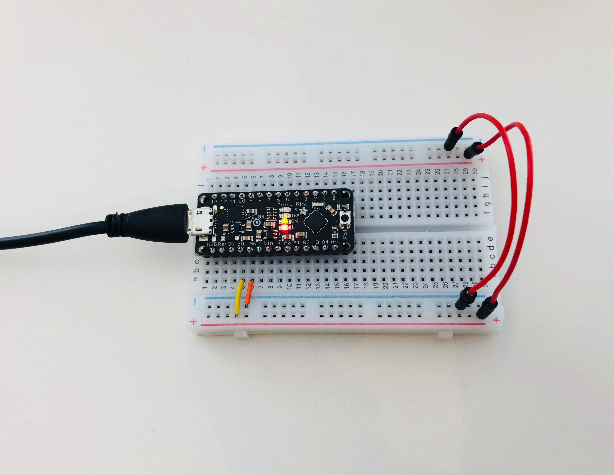
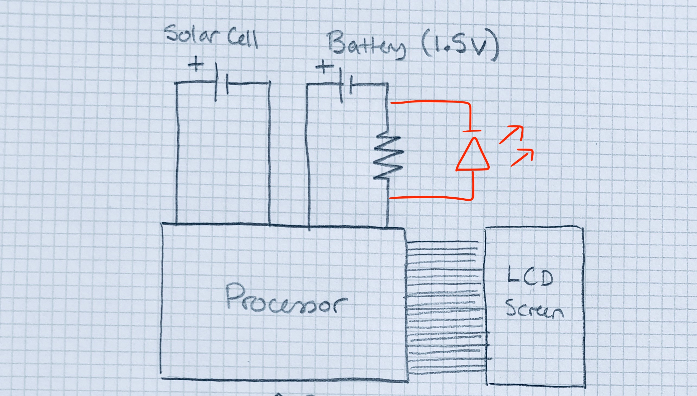
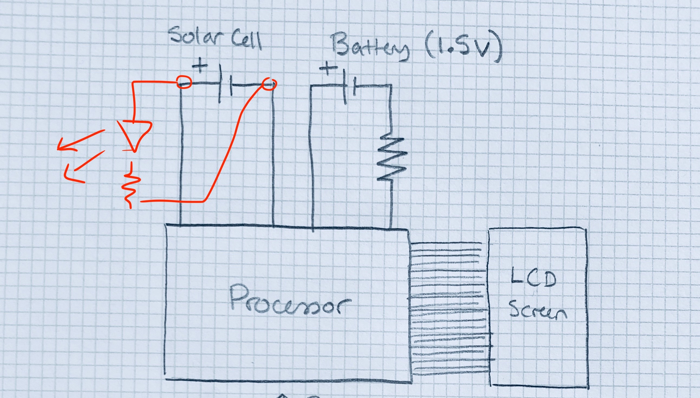

# IDD-Fa18-Lab1: Blink!

**A lab report by Devon Bain**

## Part A. Set Up a Breadboard

## Part B. Manually Blink a LED

**a. What color stripes are on a 100 Ohm resistor?**

A **100** Ohm resistor has stripes in brown, black, brown (10 x 10).

The **220** Ohm resistors we used in this lab have stripes in red, red, brown (22 x 10).
 
**b. What do you have to do to light your LED?**

After setting up the circuit, you have to press the button in order to light the LED. Pressing the button closes the switch and creates a path for current to flow from the power source to the LED.

## Part C. Blink a LED using Arduino

### 1. Blink the on-board LED

**a. What line(s) of code do you need to change to make the LED blink (like, at all)?**

You don't need to change any lines of code from the Blink example to make the LED blink. The Blink example contains a `setup` function that runs once and initializes the digital pin LED_BUILTIN as output. It also contains a `loop` function that turns the LED on and off every second by alternating between `digitalWrite(LED_BUILTIN, HIGH)` and `digitalWrite(LED_BUILTIN, LOW)`.

**b. What line(s) of code do you need to change to change the rate of blinking?**

In the `loop()` function, changing the number in `delay(1000)` changes the rate of blinking. The number is the delay in milliseconds; the shorter the delay, the faster the rate of blinking.

**c. What circuit element would you want to add to protect the board and external LED?**

You would want to add a resistor to prevent a short circuit.
 
**d. At what delay can you no longer *perceive* the LED blinking? How can you prove to yourself that it is, in fact, still blinking?**

The blinking is no longer perceptible at about 12-14ms. You can prove it is still blinking by taking a video of it and looking at each frame.

**e. Modify the code to make your LED blink your way. Save your new blink code to your lab 1 repository, with a link on the README.md.**

[Link to code](scripts/myBlink/myBlink.ino)

### 2. Blink your LED

**Make a video of your LED blinking, and add it to your lab submission.**

[Link to video](https://youtu.be/4oMwgHRqEp0)

[Link to modified code](scripts/blink_pin9/blink_pin9.ino)

## Part D. Manually fade an LED

**a. Are you able to get the LED to glow the whole turning range of the potentiometer? Why or why not?**

The LED does glow the whole turning range. If the potentiometer adds its full 10K Ohms of resistance, the current is 5V/(10000 + 220 Ohms) = about 0.5 mA. This is sufficient to get the LED to glow dimly. If it contributes 0 Ohms, the current is about 22.7 mA, producing a bright glow.

## Part E. Fade an LED using Arduino

**a. What do you have to modify to make the code control the circuit you've built on your breadboard?**

You have to change `int led = 9` to `int led = 11` in order to use pin 11. The `led` variable is used in the `pinMode` and `analogWrite` functions in place of `LED_BUILTIN`.

**b. What is analogWrite()? How is that different than digitalWrite()?**

`analogWrite()` writes a PWM value between 0-255 to a pin. It is therefore possible to have a continuum of values, unlike `digitalWrite()` which only has HIGH and LOW as its values.

## Part F. FRANKENLIGHT!!!

### 1. Take apart your electronic device, and draw a schematic of what is inside. 

The buttons are on one side of the circuit board, and the processor and connection to the screen are on the other. The button side has many different connections, and it is difficult to tell how they are connected to each other and the processor.

**a. Is there computation in your device? Where is it? What do you think is happening inside the "computer?"**

The circuit board has a central processing area in the middle, on the opposite side of the buttons. It seems to be taking input from the button presses, performing the calculation and conveying this information to the LCD where the appropriate number is displayed.

**b. Are there sensors on your device? How do they work? How is the sensed information conveyed to other portions of the device?**

It has buttons for standard calculator functions: ON/OFF, numbers 0-9, +/- etc. Key presses are conveyed through connections in the circuit board, and to the LCD screen via a piece of LCD ribbon.

**c. How is the device powered? Is there any transformation or regulation of the power? How is that done? What voltages are used throughout the system?**

The device is both solar and battery powered. It has a single LR1130 battery (1.5V) and a solar battery component (the solar cell seems to contribute power only when there is light shining directly on it.) There are also two resistors connected to the processor. 

**d. Is information stored in your device? Where? How?**

Previously-input numbers and operations are stored in the device while it is on. I assume this is done in the processor - it keeps track of the most recent number and operator that have been entered, and can retain additional numbers if the user presses the M+ button.

### 2. Using your schematic, figure out where a good point would be to hijack your device and implant an LED.

**Describe what you did here.**

I thought the easiest buttons to hijack would be the ON and OFF buttons because of their simple behavior. When the ON button is pressed, current starts flowing, and when OFF is pressed, it stops. I connected an LED by placing it across the resistor that is connected to both the processor and the battery ground. I taped the short leg to the ground side, and the long leg to the processor side, to match the flow of current.

I was concerned that the 1.5V battery would not be enough to power the light, because it is less than the 5V we had been using thus far in the lab. However, since the resistor is also smaller than the one used in the lab, the current was adequate to light the LED dimly.

The following image shows the finished product with the LED taped across the resistor. The tape was not the most sturdy solution, but it was sufficient to pick up the calculator, push the buttons and activate/deactivate the light, as shown in the video. The light turned on and off as expected.

In addition to hijacking the ON/OFF buttons, I also experimented with connecting the LED to the solar panel, using it as a kind of optical switch that would turn the LED on when light is shining on the panel. I was able to get this to work simply by connecting a red LED and 100 Ohm resistor to the solar panel, as illustrated in the diagram below. [This video](https://youtu.be/aKs-B8LhTnk) also shows the "solar-powered light" working. 

One interesting difference observed between the solar panel and the buttons is that the solar panel activates the LED more gradually. This suggests there is a delay between the solar panel absorbing the light and converting it into power for the device.

### 3. Build your light!

**Make a video showing off your Frankenlight.**

[Video of FrankenCalc in action](https://youtu.be/QWwZlxGdvoU)

[Video of solar-powered light](https://youtu.be/aKs-B8LhTnk)

**Include any schematics or photos in your lab write-up.**
